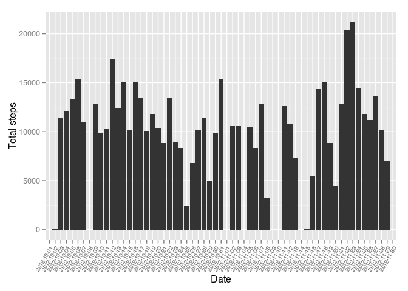
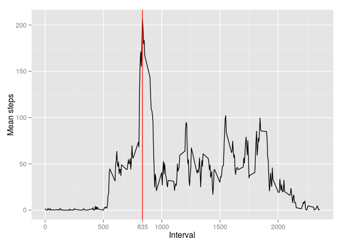
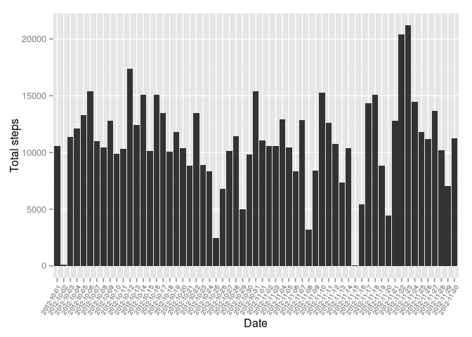
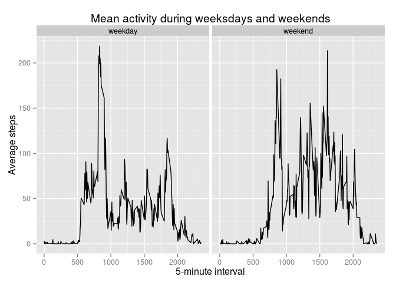

# Reproducible Research: Peer Assessment 1

```
## [1] "en_US.UTF-8"
```

## Loading and preprocessing the data

```r
dat <- as.data.frame(read.csv(unz("activity.zip", "activity.csv")))
```


## What is mean total number of steps taken per day?

```r
total <- vector()
dates <- levels(dat$date)
for (i in 1:length(dates)){
  total <- c(total, sum(unlist(subset(dat, date == levels(date)[i])$steps), na.rm = T))
}

ggplot(data = data.frame(date = dates, total_steps = total), aes(date, total_steps)) + 
  geom_bar(stat='identity') +
  theme(axis.text.x=element_text(angle=60, hjust = 1, size = 7)) +
  xlab(label = 'Date') + ylab('Total steps')
```

 

```r
# res <- vector()
# for (i in 1:length(dates)){
#   res <- c(res, mean(unlist(subset(dat, date == levels(date)[i])$steps), na.rm = T))
# }
```


Mean of the total amount of steps per day: 9354.23 and median: 10395.


## What is the average daily activity pattern?

```r
levs <- unique(dat$interval)
resmat <- matrix(rep(0, 2*length(levs)), ncol = 2)
colnames(resmat) <- c('interval', 'mean_steps')
for (i in 1:length(levs)){ 
  resmat[i, 2] <- mean(subset(dat, interval == levs[i])$steps, na.rm = T) 
  resmat[i, 1] <- levs[i]
}
resmat <- data.frame(mean_steps = as.numeric(resmat[,'mean_steps']), interval = as.numeric(resmat[,'interval']))

maxint <- as.numeric(resmat$interval[which(resmat$mean_steps == max(resmat$mean_steps))])

qplot(as.numeric(interval), mean_steps, data = resmat, geom = 'line', xlab = 'Interval', ylab = 'Mean steps') + 
  geom_vline(color = 'red', xintercept = maxint) + 
  scale_x_continuous(breaks = 
                       c(0, 500, maxint, seq(1000, 2000, 500)))
```

 

The interval with maximum average of steps is 835 with an average of 206.1698113 steps.


## Imputing missing values
The pattern used here is to sample randomly from all the other days' same intervals for the imputed value.


```r
missing_ind <- which(is.na(dat$steps))
for (i in 1:length(missing_ind)){
  steps <- as.vector(na.omit(subset(dat, dat$interval == dat[missing_ind[i],]$interval)$steps))
  repl <- sample(steps, size = 1)
  dat$steps[missing_ind[i]] <- repl
}

levs <- unique(dat$interval)
total <- vector()
dates <- unique(dat$date)
for (i in 1:length(dates)){
  total <- c(total, sum(unlist(subset(dat, date == levels(date)[i])$steps)))
}

ggplot(data = data.frame(date = dates, total_steps = total), aes(date, total_steps)) + 
  geom_bar(stat='identity') +
  theme(axis.text.x=element_text(angle=60, hjust = 1, size = 7)) +
  xlab(label = 'Date') + ylab('Total steps')
```

 


Introducing imputed values had an impact to the data. The mean with the imputed data is 10835.7 and median 10765. The mean rose by 1481.47 and median by 370.


## Are there differences in activity patterns between weekdays and weekends?


```r
dat <- transform(dat, date = as.Date(date))

day <- weekdays(dat$date)
time_of_week <- vector()
for (i in 1:length(day)){
  if (day[i] %in% c("Monday", "Tuesday", "Wednesday", "Thursday", 
  "Friday")){
    time_of_week[i] <- 'weekday'
  } else {
    time_of_week[i] <- 'weekend'
  }
}
dat <- cbind(time_of_week, dat)

weekday <- subset(dat, time_of_week == 'weekday')
weekend <- subset(dat, time_of_week == 'weekend')

reslist <- lapply(list(weekday, weekend), FUN = function(x){levs <- unique(x$interval)
resmat <- matrix(rep(0, 2*length(levs)), ncol = 2)
colnames(resmat) <- c('interval', 'mean_steps')
for (i in 1:length(levs)){ 
  resmat[i, 2] <- mean(subset(x, interval == levs[i])$steps, na.rm = T) 
  resmat[i, 1] <- levs[i]
}
resmat <- data.frame(mean_steps = as.numeric(resmat[,'mean_steps']), interval = as.numeric(resmat[,'interval']))
})

weekday <- cbind(rep('weekday', dim(reslist[[1]])[1]), reslist[[1]])
colnames(weekday) <- c('time_of_week', 'avg_steps', 'interval')
weekend <- cbind(rep('weekend', dim(reslist[[2]])[1]), reslist[[2]])
colnames(weekend) <- c('time_of_week', 'avg_steps', 'interval')

res <- as.data.frame(rbind(weekday, weekend))

ggplot(res, aes(interval, avg_steps)) + geom_line() + facet_grid(facets = . ~ time_of_week, ) + 
  labs(title = 'Mean activity during weeksdays and weekends') +
  labs(x = '5-minute interval') + 
  labs(y = 'Average steps')
```

 

Some differences can be seen from the plot between weekdays and weekends. There is a slight increase during the intervals from approximately 1200 to 1750.
